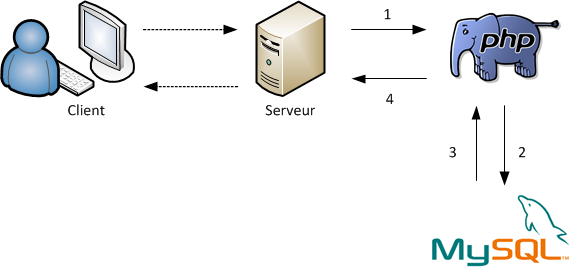
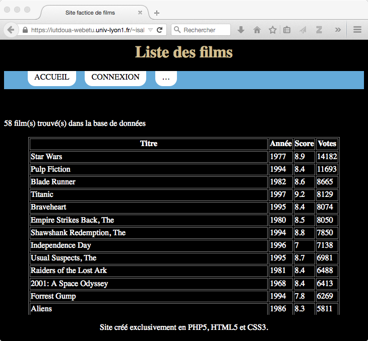

:tocdepth: 2

==============================
 Gestion des bases de données
==============================

Introduction aux bases de données
=================================

Qu'est ce qu'une base de données ?
++++++++++++++++++++++++++++++++++

Un **base de données** (BDD) sert à enregistrer des données

 * Format organisé et hiérarchisé
 * Requetable
 * Durable

Durée de vie d'une variable PHP = temps d'éxécution du script

Possibilité de stocker des données dans des fichiers externes => pas viable (grande quantité de données)

Pour manipuler une BDD, on utilise un **SGBD**.

Un SGBD ?
+++++++++

C'est un **Système de Gestion de Base de Données**.

Comme son nom l'indique, un SGBD permet :

- d'enregistrer des données
- d'organiser ces données
- d'accèder aux données

La plupart des SGBD utilisent le **langage SQL** (Structured Query Language).

Les données brutes sont stockées dans des fichiers sur le serveur.
Le SGBD a pour mission de permettre leur accès en optimisant les opération de lecture/écriture.

Quel SGBD utiliser ?
++++++++++++++++++++

Il existe plusieurs SGBD; parmi les plus utilisés on retrouve :

- MySQL
- Oracle
- Microsoft SQL Server
- PostgreSQL 

Dans ce cours, nous travaillerons avec MySQL. Il est le SGBD libre et gratuit le plus utilisé (mais pas le seul).

Comment s'interfacent PHP et MySQL ?
++++++++++++++++++++++++++++++++++++

#. Le serveur interprète le script PHP
#. Le script PHP interroge dans une requête la base de données par MySQL
#. MySQL renvoie les données en réponse à la requête
#. PHP traite les données reçues côté serveur

.. note::

  Dans ce schéma, vous pourriez remplacer PHP par n'importe quel langage dédié à la gestion de pages web dynamiques.
  De même, MySQL pourrait très bien être remplacé par un autre SGBD, tant que le langage qui utilisé de PHP au SGBD reste le SQL.

Structure d'une base de données
+++++++++++++++++++++++++++++++

Une base de données est composée de **tables**.

Chaque table est composée de **champs**.

Chaque champ contient plusieurs **valeurs**.

Chaque **entrée** ou **enregistrement** correspond à ensemble comprenant une valeur pour chaque champ.

.. tip::

  Généralement, on crée une base de donnée spécifique à chaque site web.
  Mais il est aussi possible de partager une même base entre plusieurs sites.

.. nextslide::

On peut voir une table comme un tableau de la forme :

============ =========== =========== =========== 
Identifiant   Champ1      Champ2      ...
============ =========== =========== =========== 
  1          Valeur11     Valeur21    ...
  2          Valeur12     Valeur22    ...
  3          Valeur13     Valeur23    ...
  ...        ...          ...         ...
============ =========== =========== =========== 

.. tip::
  
  Le champ identifiant n'est pas obligatoire, mais il permet d'affecter une valeur unique à chaque enregistrement.
  L'utilisation d'identifiants permet aussi de lier les données de plusieurs tables entre-elles.

.. _gestion_bdd:
 
Créer et gérer une base de données
==================================
 
L'interface PhpMyAdmin
++++++++++++++++++++++

Pour faciliter les opérations de gestion des bases de données, il existe un outil nommé **PhpMyAdmin**,
qui propose une interface de gestion Web des BDD sous la forme de pages PHP permettant (entre autres) :

- la création/suppression de bases de données;
- la création/modification/suppresion de tables;
- la création/modification/suppresion de champs;
- la création/modification/suppresion d'enregistrements;
- la visualisation des données enregistrées;
- l'importation/exportation de bases de données (complètes ou partielles).
 
Accéder à PhpMyAdmin
++++++++++++++++++++

* Depuis le site Web de l'IUT  : http://iutdoua-webetu.univ-lyon1.fr/phpMyAdmin/
   - login habituel : pxxxxxxx
   - mot de passe : code initial
   
* Depuis un serveur local (type WAMP) : http://localhost/phpMyAdmin
 
.. figure:: _static/bdd/phpmyadmin.png
		:alt: phpmyadmin
 
 
.. _exo_phpmyadmin:  

Exercice
++++++++

L'objectif de cet exercice est de se familiariser avec l'interface PhpMyAdmin.

Instructions :

#. Créez une base de données nommée "bdd_films".
#. Créez une table nommée "films" avec les champs "id_film" (entier, clé primaire), "nom_film" (chaîne de caractères), "année_film" (entier) et "score" (nombre flottant).
#. Remplissez vos tables avec quelques données (5-10 films).

Interroger une base de données
==============================

Se connecter à une base de donnnées
+++++++++++++++++++++++++++++++++++

Avant de pouvoir lire ou écrire dans une base de données, il est nécessaire de s'y connecter.

La connexion à une base de données est un processus d'authentification qui permet de s'assurer que seuls les utilisateurs autorisés peuvent accéder aux données et/ou les modifier.

Les SGBD utilisent un vocabulaire spécifique relatif au processus de connexion :

* **l'hôte** est l'adresse du serveur qui héberge la base de données;
* **la base** est le nom de la base de donnée à laquelle on souhaite se connecter
* **user** est l'identifiant de l'utilisateur
* **password** est le mot de passe de cet utilisateur (connexion sécurisée).

Type de connexion
-----------------

PHP propose plusieurs fonctionnalités intégrées pour se connecter à une base de données via un SGBD.
Les évolutions successives de PHP explique l'existance de 3 exentions :

* ``mysql_`` : les fonctions dont le nom commence par cette extension permettent d'accéder à une BDD gérée par MySQL;
* ``mysqli_`` : propose des fonctionalités améliorées pour MySQL;
* ``PDO`` : constitue la concrétisation d'un effort d'unification entre les différents SGBD.

En conclusion, ``PDO`` est une solution générique qui permettra d'utiliser le même code pour dialoguer avec les différents SGBD.
C'est aussi une version optimisée qui utilise les fonctionnalités avancées des dernières versions de PHP (nottament la programmation orientée objet).

Se connecter en PHP
-------------------

Fonction de connexion :

.. code-block:: php

  <?php
   function Connect_db(){
	$host="localhost"; // ou sql.hebergeur.com
	$user="root";      // ou login
	$password="";      // ou xxxxxx
	$dbname="nom_bdd";
    try {
	 $bdd=new PDO('mysql:host='.$host.';dbname='.$dbname.
	              ';charset=utf8',$user,$password);
	 return $bdd;
	} catch (Exception $e) {
	 die('Erreur : '.$e->getMessage());
    }
   }
  ?>
  
.. _requete_bdd:
  
Faire une requête sur une base de données
+++++++++++++++++++++++++++++++++++++++++
  
Après s'être connecté à une base de données, il est possible d'accéder à son contenu, en suivant le protocole suivant :

#. On **interroge** une base de données grâce à une **requête**. Une requête constitue une instruction qui spécifie quelle(s) donnée(s) de quelle(s) tables on souhaite récupérer.
#. Le SGBD se charge de **filtrer** et **trier** les données correspondantes à la requête et les **collecte** dans une structure de données exploitable en PHP (c'est à dire, un tableau).

Ecrire une requête
------------------

Les requêtes sont interprétées par le SGBD, elles sont dont formulées dans le langage qu'il manipule, c'est à dire le SQL.

Le langage SQL est dédié à l'écriture de requêtes. Sa syntaxe, sous forme de chaîne de caractères, permet de créer des requêtes complexes à partir de quelques mots clés.

Les instructions SQL
--------------------

Le langage SQL est articulé autour de mots-clés facilement interprétables, exemple :

* ``SELECT`` : sélection des champs
* ``FROM`` : choix de la table
* ``WHERE`` : condition (peut être composée avec ``AND``/``OR``)
* ``ORDER BY`` : règle de tri (par champ)
* ``LIMIT`` : limite du nombre d'enregistrements
* ``INSERT INTO`` : insertion d'un enregistrement
* ``VALUES`` : précise les valeurs à enregistrer
* ``UPDATE`` : mise à jour d'un enregistrement
* ``DELETE`` : suppression d'un enregistrement
  
.. note:

	Cette liste n'est pas exhaustive : il est possible de tout faire avec des requêtes SQL (y compris création/suppresion de table et même de BDD).
 
Requête de lecture
------------------

L'ordre des mots-clés est figé, mais il n'est pas obligatoire de tous les utiliser.

Un exemple d'une requête de lecture complète pourrait être :

.. code-block:: sql

  SELECT champ1, champ2, champ3
  FROM table 
  WHERE champ1='valeur'
  AND champ2 < 20
  OR champ 3 > 0
  ORDER BY champ2 DESC, champ3 ASC
  LIMIT 0,5

.. tip::

  Le sélecteur ``*`` permet de sélectionner tous les champs d'une table : ``SELECT *``.
  
.. nextslide::

* Il est possible de ne sélectionner qu'une partie des champs d'une table.
* Il est possible de sélectionner les champs de plusieurs tables. Dans ce cas, il faut écrire ``table.champ`` après le ``SELECT`` (pas obligatoire si les noms des champs diffèrent).
* ``WHERE`` indique le début des conditions qu'il est possible de combiner avec les opérateurs ``AND`` et ``OR`` en plus des parenthèses.
* Le tri peut se faire sur plusieurs champs, par ordre d'apparition après ``ORDER BY``. C'est l'ordre alphabétique qui s'applique sur un champs texte. 
* La limite du nombre d'enregistrement s'écrit : ``LIMIT indice_debut, indice_fin`` ; il y aura donc ``indice_fin - indice_debut`` enregistrements sélectionnés. Si un seul indice est précisé, la requête renverra ce nombre d'enregistrements à partir du premier (**dans l'ordre définie par le tri**). 

Requête d'écriture
------------------

D'autres mots-clés permettent d'ajouter/modifier/supprimer un enregistrement dans une table.

Exemple d'**insertion** :

.. code-block:: sql

  INSERT INTO table(champ1,champ2, champ3)
  VALUES (valeur1, valeur2, valeur3)
 
.. warning::

  Les SGBD sont très sécurisés au niveau des requêtes d'insertion. Aussi, la requête se traduira systématiquement par
  un échec dans le cas d'oubli d'un des champs ou de types de paramètres incompatibles.
  
  Toutes les vérifications devront êtres faites côté PHP avant génération de la requête SQL.
 
.. note::

  Si un champ de la table à été déclaré comme une clé primaire (identifiant) avec la propriété ``auto_increment``,
  il n'est pas nécessaire de faire apparaître ce champ ni sa valeur dans une requête d'insertion.
 
 
.. nextslide::

Exemple de **modification** :

.. code-block:: sql

  UPDATE table SET champ2 = valeur2, champ3 = valeur3 
  WHERE champ1 = valeur1
  
.. warning:: 

  Les requêtes de modifications utilisent aussi une partie sélection.
  
  La requête n'aboutiera pas si la condition du ``WHERE`` n'est pas satisfaisable.
  
.. note::
  
  Il est possible de modifier plusieurs enregistrements en une seule requête : c'est la condition de sélection qui fait la différence.
 
.. nextslide::

Exemple de **suppression** :

.. code-block:: sql

  DELETE FROM table WHERE champ1=valeur1

.. warning::

  Les suppressions ne sont **pas annulables**.
  
  Attention : sans la condition ``WHERE`` tous les enregistrements de la table seront supprimés !
 
.. _exo_sql:
 
Exercice
--------

Depuis PhpMyAdmin, il est possible de taper directement des requêtes SQL et d'afficher le résultat retourné.

#. Accédez à votre base de données de l'`exercice précédent<exo_phpmyadmin>`:ref:
#. Depuis le formulaire de requêtes de PhpMyAdmin, écrire une requête pour récupérer le nom de tous les films
#. Ecrire une requête permettant de récupérer au plus 5 films parmi les plus récents (<= 2010)
#. Récupérez le nom et la note de tous les films et triez le résultat par note (croissant)
#. Ajouter un nouveau film nommé "Alien", de 1979 et noté 8.5

 
.. _lecture_bdd:
 
Lire les données d'une base de donnnées
---------------------------------------

La lecture de données depuis une BDD s'exécute suivant ce protocole :

#. Connexion à la BDD,
#. Préparation de la requête,
#. Interrogation de la BDD via une requête SQL,
#. Récupération de la réponse complète,
#. Lecture enregistrement par enregistrement,
#. Fin de la lecture et libération de la ressource.

Exemple générique
-----------------

.. code-block:: php
  :linenos:
  
  <?php
   $bdd = Connect_db(); //connexion à la BDD
   $query = $bdd->prepare('...'); // requête SQL
   $query->execute(...); // paramètres et exécution
   while($data = $query->fetch()) { // lecture par ligne
      ... // traitement de l'enregistrement
   } // fin des données
   
   $query->closeCursor();
  ?>

.. nextslide::
  
Quelques remarques :
  
* Dans la requête, si on veut injecter des paramètres, il faut le spécifier par le caractère anonyme ``?`` ou un identifiant précédé par ``:``.
* La fonction ``execute()`` exécute la requête avec les paramètres fournis sous la forme d'un tableau simple (paramètres anonymes) ou associatif (paramètres identifés). Il n'est pas nécessaire de préciser de paramètres si la requête SQL n'en comporte pas.
* La fonction ``fetch()`` retourne un tableau associatif dont les clés correspondent aux champs sélectionnés par la requête.
* La lecture s'arrête lorsque l'affectation de l'enregistrement échoue : il n'y a plus de données à lire.
* La fonction ``closeCursor()`` permet de libérer la ressource lorqu'on a fini les traitements sur les données retournées par le SGBD.

.. nextslide::

.. warning::
  
  Une faille connue nommée "injection SQL" peut être exploitée lorsque l'on utilise des données entrées par l'utilisateur dans des requêtes SQL.
  Afin d'éviter que d'autres requêtes soient injectées dans les variables via PHP, il faut TOUJOURS utiliser les fonctions ``prepare()`` et ``execute()``. 

Requête sans paramètres
-----------------------

.. code-block:: php
  :linenos:
  
  <?php
   ...
   $query=$bdd->prepare('SELECT * from table');
   $query->execute();
   ...
  ?>
  
.. note::

  Pour gagner du temps, il est aussi possible d'utiliser la fonction ``exec()`` qui prend en paramètre une requête, et s'applique sur l'objet BDD :
  
  ``$query=$bdd->exec('...');``.

  Attention : n'utilisez la fonction ``exec()`` que si la requête ne comporte pas de paramètres (pas de variables PHP) pour éviter la faille d'injection SQL.

  
Requête avec paramètres anonymes
--------------------------------

.. code-block:: php
  :linenos:
  
  <?php
   ...
   $query=$bdd->prepare('SELECT champ1, champ2 
                         FROM table
	                 WHERE champ1 = ?  
	                 AND champ3 <= ? 
	                 ORDER BY champ2');
   $query->execute(array($valeur1, $valeur2));
   ...
  ?>

Requête avec paramètres identifiés
----------------------------------
  
.. code-block:: php
  :linenos:
  
  <?php
   ...
   $query=$bdd->prepare('SELECT champ1, champ2 
                         FROM table
	                 WHERE champ1 = :valeur1  
	                 AND champ3 <= :valeur2 
	                 ORDER BY champ2');
   $query->execute(array('valeur1' => $valeur1,
                         'valeur2' => $valeur2));
   ...
  ?>
  
.. _exo_requete:
  
Exercice
--------

#. Créer une page contenant la fonction de connexion à la BDD films
#. Récuperez la liste des films avec la requete adéquate
#. Afficher le résultat

.. _ecriture_bdd:

Ecrire des données dans une base de donnnées
--------------------------------------------

L'écriture de données dans une BDD se fait en suivant les étapes suivantes :

#. Connexion à la BDD,
#. Préparation de la requête,
#. Exécution de la requête.

Trois actions sont possibles pour l'écriture : insertion, modification ou suppression d'un enregistrement.

Exemple générique
-----------------

Avec paramètres :

.. code-block:: php
  :linenos:
  
  <?php
   $bdd = Connect_db(); //connexion à la BDD
   $query = $bdd->prepare('...'); // requête SQL
   $query->execute(...); // paramètres et exécution
  ?>

.. nextslide::
  
Sans paramètres :

.. code-block:: php
  :linenos:
  
  <?php
   $bdd = Connect_db(); //connexion à la BDD
   $query = $bdd->exec('...'); // requête SQL
  ?>
  
.. note::

  Pour effectuer chacune des opérations (ajout, modification, suppression), il suffit de choisir la bonne requête (``INSERT INTO, UPDATE SET, DELETE FROM``);

  
.. _exo_ecriture:
  
Exercice
---------

#. Créer une page "ajout_film.php"
#. Créer et afficher un formulaire simple permettant l'ajout d'un film
#. Modifier la page pour que les données envoyées soient insérées dans la table films de votre BDD.
#. Ajoutez les tests nécessaires au traitement des données entrées
#. Si l'utilisateur entre un nom de film déja existant dans la table, appliquer une requête de modification avec les nouvelles données (empêchez la création de doublons).

.. _jointure_bdd:

Les requêtes de jointure
------------------------

Un des intérêts majeurs des BDD est de pouvoir lier des données entre-elles afin de leur donner une sémantique plus forte.

L'utilisation d'identifiants uniques (**clés primaires**) pour chaque enregistrement, permet leur réutilisation dans d'autres tables.
On les appelle alors des **clés secondaires** (ou **clés étrangères**).

Exemple, table "Films":

============ =========== =========== =========== 
ID_FILM      TITRE_FILM  ANNEE_FILM      ...
============ =========== =========== =========== 
  1          Titanic      1997        ...
  2          Star Wars    1977        ...
  3          Braveheart   1995        ...
  ...        ...          ...         ...
============ =========== =========== =========== 

.. nextslide::

Exemple, table "Acteurs":

============ =========== =============== =========== 
ID_ACTEUR    NOM_ACTEUR  PRENOM_ACTEUR      ...
============ =========== =============== =========== 
  1          Di Caprio    Leonardo        ...
  2          Winslet      Kate            ...
  3          Gibson       Mel             ...
  ...        ...          ...             ...
============ =========== =============== =========== 

Les champs ``ID_FILM`` et ``ID_ACTEUR`` sont les clés primaires de leurs tables respectives.

.. nextslide::

Exemple de table de jointure, table "Casting" :

============ ===========
ID_FILM      ID_ACTEUR 
============ ===========
  1           1  
  1           2    
  2           3     
  ...         ...         
============ ===========

Ici, les champs ``ID_FILM`` et ``ID_ACTEUR`` deviennent clés étrangères et permettent de lier les tables "Acteurs" et "Films".

Pour pouvoir accéder aux données présentes dans des tables jointes de la sorte, il faut utiliser les **requêtes de jointure**.

Aller plus loin avec les requêtes SQL
-------------------------------------

**Les alias :**

Pour écrire une requête qui intervenant sur plusieurs tables jointes, il est possible de simplifier l'écriture en définissant des **alias**.

Deux écritures sont possibles après la clause ``FORM`` :

.. code-block:: sql

	SELECT * 
	FROM table AS alias
 
Ou 

.. code-block:: sql

	SELECT * 
	FROM table t
 
.. note::

  La première version reste la plus lisible.

  Notez que par convention, les noms des tables s'écrivent en minuscules. Une bonne pratique est de conserver ce format mais de réduire leur taille en utilisant des alias.  
 
.. nextslide::

**Les requêtes de jointure** s'écrivent en utilisant le mot clé ``INNER JOIN ... ON``. La clause ``ON`` permet de définir la condition de la jointure (c'est à dire la correspondance entre les clés primaires/étrangères).

Exemple :

.. code-block:: sql

  SELECT * 
  FROM table1
  INNER JOIN table2
  ON table1.ID_CHAMP1 = table2.ID_CHAMP2

  
.. tip::

  On peut bien sûr imbriquer plusieurs jointures lorsque plus de deux tables sont liées.
  Pour cela, il suffit de préciser les conditions de jointures les unes après les autres (``INNER JOIN ... ON ... INNER JOIN ... ON``).

.. _exo_jointure:
  
Projet 1: Site de films
=======================

Consignes interface:

* Interface se rapprochant de la présentation ci-dessous
* Uniquement du PHP, HTML et CSS
* pas de framework, ni de moteur de templates
* passer le valideur HTML5 et CSS3 sans erreur
* placer les fichiers dans le répertoire public_html/PHP/projet1 du login hébergeant le projet
* envoyer un zip du répertoire projet1 par mail à l’enseignant en mettant le binôme en CC

