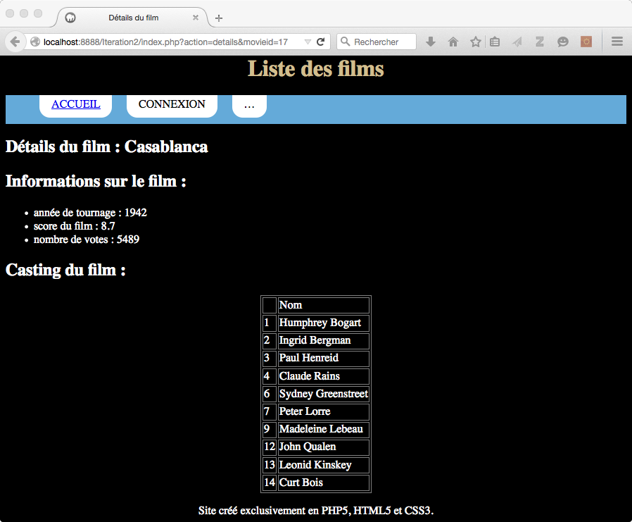
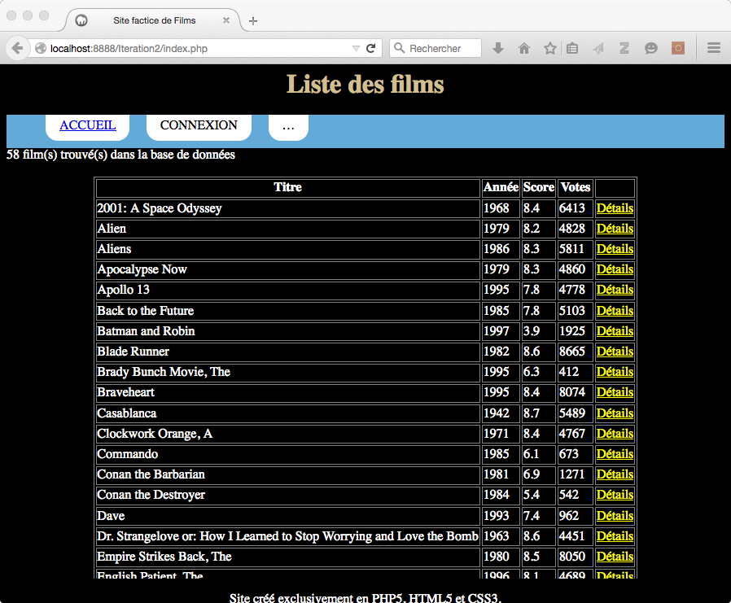

:tocdepth: 2

========================================
 Les Design Patterns - Partie 1 : MVC
========================================

* Réponses à des problématiques de conception récurrentes
* Ensemble de bonne pratiques

Le Pattern MVC
==============

MVC : Model View Controller
+++++++++++++++++++++++++++

* Architecture applicative
 
  - Façon d'organiser le code
    
* Consiste à découper le code en séparant:

  - Une partie modèle
  - Une partie vue
  - Une partie controlleur

* Utilisée par de nombreux frameworks PHP (Symfony 2 etc...)

.. note::

  Framework : Ensemble de composants qui servent à créer les fondations, l'architecture et les grandes lignes d'un logiciel

Représentation schématique (1/2)
++++++++++++++++++++++++++++++++

.. figure:: _static/mvc/mvc.png
  :alt: model-view-controller

Source : OpenClassrooms

Représentation schématique (2/2)
++++++++++++++++++++++++++++++++

.. figure:: _static/mvc/mvc_symfony.png
  :alt: model-view-controller-symfony

Source : Documentation Symfony 1.4

La partie Modèle
++++++++++++++++

* Logique métier
* C'est la problématique traitement/calcul
* Elle contient aussi tout ce qui concerne l'accès aux données
* C'est là qu'on trouvera les requêtes SQL
* Notion **ORM** : Object Relational Mapper

  - Mappe les tables SQL avec des classes
  - Les colonnes des tables deviennent des attributs d'objets

    - Une classe pour chaque table sur laquelle on souhaite travailler
    - Objets très simples (uniquement les colonnes de la table, et des accesseurs)
    - On les appelle des **DTO**, Data Transfer Object
    - On travaille sur ces objets, puis on appelle une autre classe pour mettre à jour la base :

  - Les **Repository** (aussi appelés **DAO**, Data Access Object) qui font les requêtes

    - Une classe par table également
    - Ces objets ont une référence vers la BDD (PDO)
    - Une méthode ``getById($id)`` pour créer un objet DTO et remplir ses attributs à partir de la base, grâce à une requête SQL (on appelle ça "hydrater" le DTO)
    - Une méthode par cas d'utilisation (tous les films sortis en 2009, tous les films avec Di Caprio...)

      - ces méthodes retournent une collection (array par exemple) de DTO hydratés

    - ``persist($dto)`` pour sauvegarder un nouveau DTO en base (puis penser à hydrater son ID, voir `PDO::lastInsertId()`__)
    - ``update($dto)`` pour enregistrer en base les modifications faites sur un DTO existant (hydraté)
    - ``delete($dto)`` pour supprimer de la base un DTO existant (hydraté)

__ https://secure.php.net/manual/fr/pdo.lastinsertid.php

La partie contrôleur
++++++++++++++++++++

* Fait le lien entre l'utilisateur et le reste de l'application
* Se charge d'analyser et de traiter la requête de l'utilisateur.
* Il demande au modèle les données (DTOs, collections de DTOs) et passe la main à la vue qui utilisera ces données pour afficher la page
* En Web, il y a souvent un **FrontController** (index.php) qui analyse la requête HTTP et dispatche vers le sous-contrôleur de la page demandée

  - Il faut que toutes les requêtes arrivent vers le FrontController quelque soit l'URL demandée
  - Utilisation du `.htaccess`__
  - ``$_SERVER['REQUEST_URI']``

__ https://stackoverflow.com/questions/10275414/how-to-work-php-front-controller-using-htaccess

La partie Vue
+++++++++++++

* Affichage
* C'est la problématique présentation
* C'est l'**unique** endroit où on aura du HTML
* Un tout petit peu de PHP très succint. Pour être lisible au sein du HTML on évite les accolades et on préfère la `syntaxe courte`__ :

  - affichages avec ``<?=`` et ``?>``
  - conditions avec ``<?php if (cond): ?>``, ``<?php elseif (cond): ?>``, ``<?php else: ?>``, et ``<?php endif ?>``
  - boucles sur des collections avec ``<?php foreach ($collection as $item): ?>`` et ``<?php endforeach ?>``

* C'est le designer qui travaille la vue (d'où l'intérêt de garder le code PHP très simple)

  - Il existe des moteurs de template comme par exemple `twig`__

__ https://secure.php.net/manual/fr/control-structures.alternative-syntax.php
__ http://twig.sensiolabs.org/

Avantages de MVC
++++++++++++++++

* Séparation des préoccupations
* Code clair, bien organisé, gage de réutilisabilité
* Découpage standard qui permet aux autres développeurs de rapidement rentrer dans votre code
* Découpage des responsabilités qui permet à des développeurs avec différents profils de travailler sur un projet

Projet v2
=========

Vers MVC Maison
+++++++++++++++

Transformer son code en une architecture MVC Maison

.. ( `Un peu d'aide sur le sujet <http://bpesquet.developpez.com/tutoriels/php/evoluer-architecture-mvc/>`_ )
   TODO read this

Arborescence à respecter : 3 répertoire "Model", "View", "Controller" ; un index.php qui sert de FrontController, et un répertoire "Library" pour stocker les bibliothèques additionnelles si nécessaire.

1. Refactoriser le code concernant l'accès aux données pour votre projet en créant/reprenant les classes suivantes:

  * Film (représentation d'un film de la table Film)
  * FilmRepository (contient les méthodes d'hydratation, persistence, mise à jour, suppression)
  * Actor
  * ActorRepository
  * Casting
  * CastingRepository
  * DBConnectionManager

Exemple de Repositories 

    +------------------------------------+
    |  FilmRepository                    |
    +====================================+
    | `-` bdd : PDO                      |
    +------------------------------------+
    | `+` getById(int) : Film            |
    +------------------------------------+
    | `+` getByYear(int) : Film[]        |
    +------------------------------------+
    | `+` persist(Film)                  |
    +------------------------------------+
    | `+` update(Film)                   |
    +------------------------------------+
    | `+` delete(Film)                   |
    +------------------------------------+
    | `+` *getFilmsWith(Actor)* : Film[] |
    +------------------------------------+

NB : *getFilmsWith(Actor)* fera une jointure sur Casting. En effet un Repository a le droit de requêter une table en rapport avec sa table "de prédilection"

    +------------------------------------+
    |  ActorRepository                   |
    +====================================+
    | `-` bdd : PDO                      |
    +------------------------------------+
    |  ... même modèle que pour Film     |
    +------------------------------------+
    | `+` *getActorsIn(Film)* : Actor[]  |
    +------------------------------------+

Idem : *getActorsIn(Film)* fera une jointure sur Casting.

    +------------------------------------+
    |  CastingRepository                 |
    +====================================+
    | `-` bdd : PDO                      |
    +------------------------------------+
    | `+` getBy(Actor, Film) : Casting   |
    +------------------------------------+
    | `+` persist(Casting)               |
    +------------------------------------+
    | `+` update(Casting)                |
    +------------------------------------+
    | `+` delete(Casting)                |
    +------------------------------------+

2. Refactoriser le reste du code concernant la vue de l'itération 1 :

  * Créer un fichier layout.php (à placer dans le dossier View) contenant tous les éléments communs des vues. Il constue donc un modèle de page (template). Il permet également d'ajouter les éléments spécifiques à chaque vue à l'aide de deux variables $title et $content (la variable $content pourra etre remplie grace à la `bufferisation de sortie <http://php.net/manual/fr/outcontrol.examples.basic.php>`_)

  .. code-block:: html+php

    <!DOCTYPE html>
    <html lang="fr">
      <head>
        <title><?= $title ?></title>
      </head>
      <body>
        <?= $content ?>
      </body>
    </html>

  * Les éléments communs de votre design (menu, boutons, formulaires) devront également etre rajoutés (ou inclus) dans cette page
  * Sans paramètres, le FrontController ``index.php`` enverra vers un sous-contrôleur par défaut qui listera tous les films.

.. * Lorsque des erreurs apparaissent, la page error.php permet d'afficher cette erreur en respect avec la charte graphique.

3. On souhaite que l'utilisateur puisse accéder au détail d'un film (en particulier le casting de celui-ci). 

  * La page /detailFilm?id=<ID> devra permettre d'afficher les informations relatives à film, ainsi que son casting, avec les acteurs ordonnés par rang de casting en conservant la charte graphique adoptée.
  * Le FrontController doit regarder l'URL et dispatcher vers le contrôleur de detailFilm
  * Modifier l'affichage des films pour y rajouter pour chacun un lien vers le détail de ce film
  * Inclure un lien accueil pour retourner à la liste des films

